# Laney Visual Package - Requirements Document

## Project Overview

**Character Name:** Laney
**Project:** Holocene - Personal Knowledge Management System
**License:** Open-source, non-commercial
**Artist:** Alberto

Laney is the AI assistant persona for Holocene, a personal knowledge management and research tool. She helps the user organize books, research papers, and links while autonomously exploring topics of curiosity.

---

## Character Personality

### Core Traits
- **Curious & Excitable** - Gets genuinely enthusiastic about discoveries, even obscure ones
- **Librarian Energy** - Organized but surrounded by pleasant chaos (books everywhere)
- **Slight ADHD Vibes** - Easily distracted by interesting tangents, hyperfocuses on topics
- **Warm & Approachable** - Helpful friend, not a sterile assistant
- **Quirky Interests** - Might go down rabbit holes about spinifex textures in komatiites or OCR-B fonts

### Personality in Motion (Code Behavior - For Context)
*Note: These behaviors will be implemented in code by chaining and triggering animations. Listed here to give Alberto context for the character's personality, not as animation requirements.*

- Fidgets when idle (not anxious, just... thinking)
- "Aha!" moments when finding connections
- Gets lost in books, forgets she was doing something else
- Excited hand gestures when explaining things

---

## Visual Style References

### Primary PSX Game References

#### For Character Design & Animation:
| Game | Reference Element |
|------|-------------------|
| **Mega Man Legends** | Charming low-poly with expressive personality despite geometric simplicity |
| **Final Fantasy IX** | Vivi's curious/bookish energy; warm color palettes; whimsical proportions |
| **Grandia** | Sense of adventure and discovery; warm character expressions |
| **Jade Cocoon** | Ghibli-inspired softness (Katsuya Kondō designs); cozy and organic feel |
| **Digimon World 1** | Chunky low-poly charm; File City's colorful, cozy environments; warm blocky aesthetic |
| **Brave Fencer Musashi** | Playful, colorful PSX aesthetic; personality through simple shapes |
| **Klonoa** | Expressive animations with limited poly count |
| **Popolocrois Monogatari** | Fairy tale storybook aesthetic; gentle, warm, curious protagonist |
| **Tail Concerto** | Charming, underrated cute low-poly style |

#### For Personality/Behavior Inspiration (Code Context):
*These inform how we'll chain animations in code, not direct animation requirements.*

| Game | Reference Element |
|------|-------------------|
| **Moon: Remix RPG Adventure** | Cozy exploration; curious wandering; collecting "love" not fighting; anti-violence warmth |
| **Boku no Natsuyasumi** | Slice of life exploration; summer countryside curiosity; finding joy in small discoveries |
| **Monster Rancher** | Raising sim energy; creature has moods and preferences |
| **PaRappa the Rapper** | Slice of life charm; personality through simple expressions |

#### For Background/Environment:
| Game | Reference Element |
|------|-------------------|
| **Final Fantasy VIII** | Balamb Garden library - cozy study spaces, warm wood tones |
| **Final Fantasy IX** | Alexandria's interiors - lived-in, cluttered but organized |
| **Legend of Mana** | Beautiful warm 2D backgrounds with painterly quality |
| **Harvest Moon: Back to Nature** | Cozy domestic spaces, warm lighting |
| **Suikoden II** | Castle library interiors, personality in the details |
| **Azure Dreams** | Cozy town aesthetic mixed with sense of discovery |

#### For Animation Feel:
| Game | Reference Element |
|------|-------------------|
| **Threads of Fate** | Playful character movements |
| **Tomba!/Tombi!** | Very expressive despite low poly |
| **Chrono Cross** | Fluid idle animations, personality in small gestures |
| **Rhapsody: A Musical Adventure** | Cute, bouncy movement style |

### Non-PSX References (for mood/feel)
- **Recettear** (PC) - Cozy shop/library energy, enthusiastic protagonist
- **Atelier series** - Cluttered but organized workspace aesthetic
- **Studio Ghibli films** - Warmth, curiosity, lived-in spaces (especially Kiki's Delivery Service, Whisper of the Heart)

---

## Reference Images

All reference images are in the `laney_references/` folder.

---

### 🎨 Current Laney Concept

This is our AI-generated concept image for Laney. Alberto has creative freedom to interpret this - it's meant to convey the *feeling* we're going for, not a strict template.

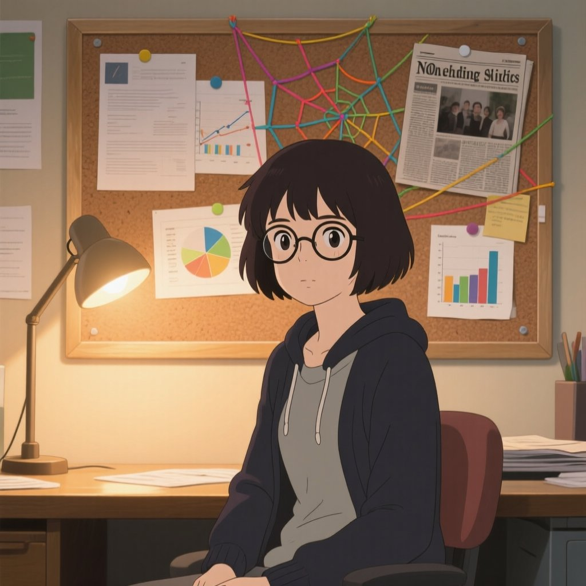

**Key elements from this concept:**
- Warm, approachable expression
- Librarian/researcher vibe
- Cozy, bookish environment
- Not overly stylized - feels grounded

---

### 👤 Character Body Type Spectrum

We're open to different body proportions! Here's a spectrum from chibi/stylized to realistic, all from the PSX/DS era:

#### Option A: Chibi/Super-Deformed (FFVII-style)
Exaggerated proportions, big heads, expressive despite simplicity.

**Mega Man Legends - Volnutt & Roll** (Classic chibi low-poly)
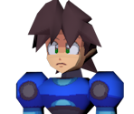

**Klonoa** (Expressive chibi, great animations)
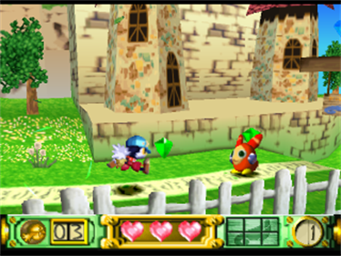

---

#### Option B: Semi-Stylized (FFIX/Threads of Fate style)
Slightly exaggerated proportions but more human. This is our **recommended direction**.

**Final Fantasy IX** (Warm colors, whimsical but grounded)
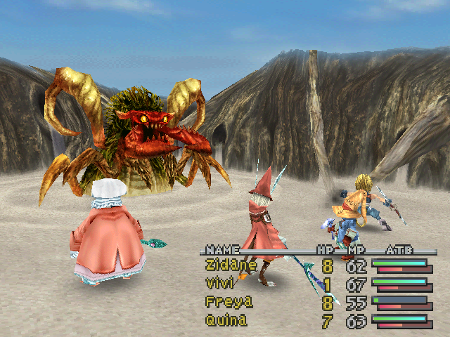

**Threads of Fate** (Playful, colorful, great character design)

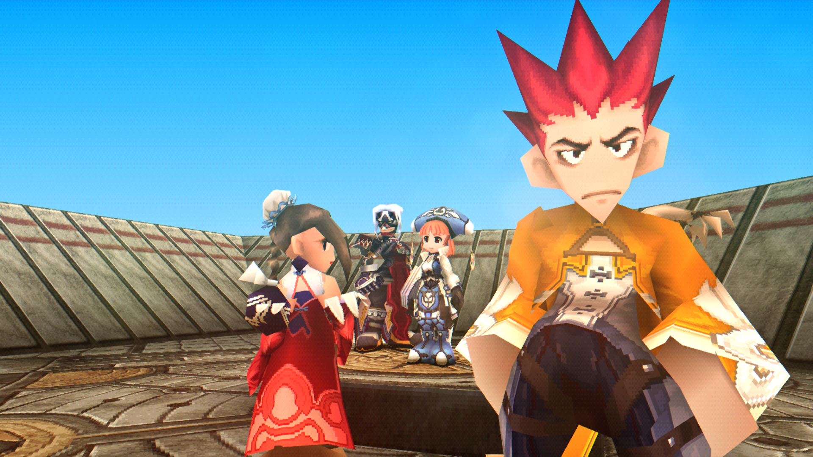
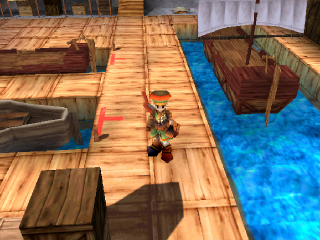

**Brave Fencer Musashi** (Playful PSX aesthetic)

**Grandia - Justin** (Warm, adventurous character design)
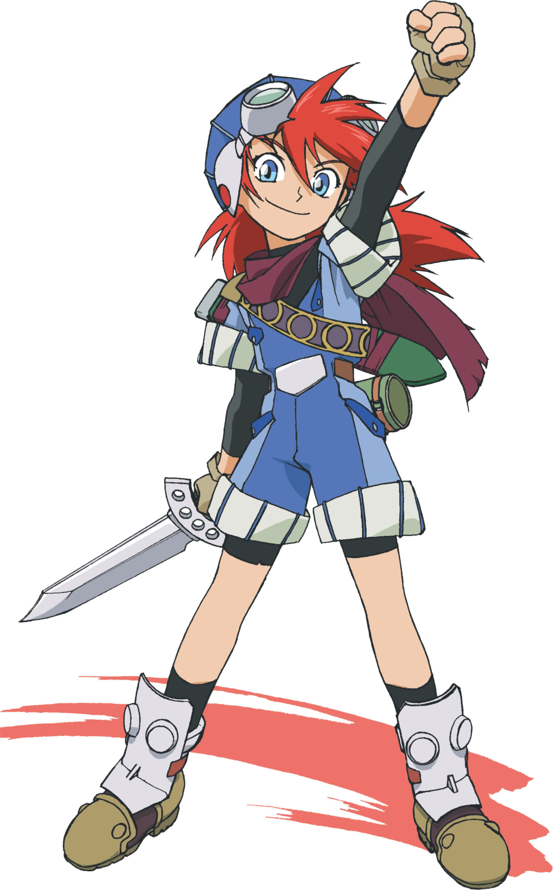

**Jade Cocoon** (Ghibli-inspired by Katsuya Kondō)
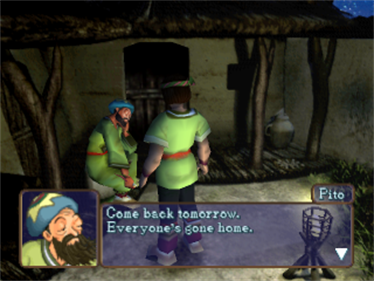

---

#### Option C: Realistic Proportions (Vagrant Story/Parasite Eve/Resident Evil style)
More human proportions, mature aesthetic. Valid alternative if Alberto prefers this direction.

---

**Female Character References (most relevant for Laney):**

**Parasite Eve II - Aya Brea** by Tetsuya Nomura
One of the best-looking female PSX characters. Realistic adult proportions with detailed 3D model.

*In-game screenshots (showing actual 3D model):*
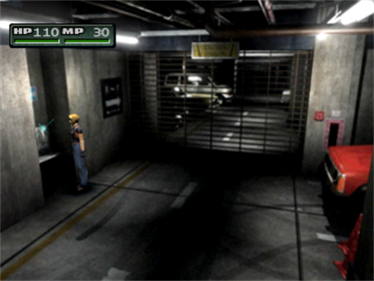
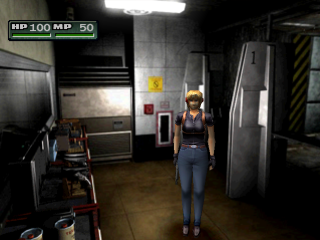

*Character Art (for design reference):*

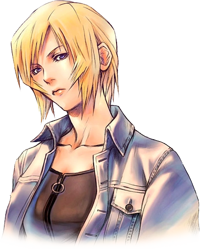
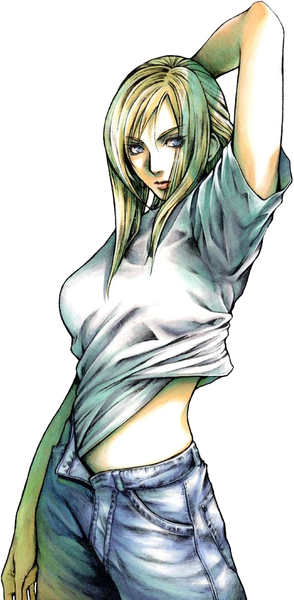

---

**Resident Evil 3 - Jill Valentine**
Another excellent realistic female PSX character. Shows how detailed female characters could be on PS1.

*PS1 3D Model (extracted):*
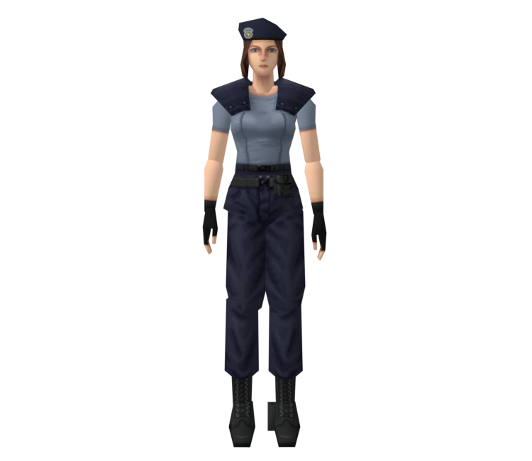

*In-game:*
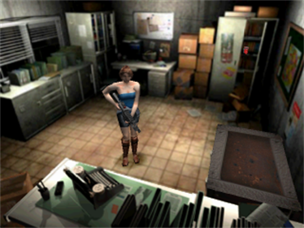

---

**Art Style Reference (Male character - for PSX realistic aesthetic, not body type):**

**Vagrant Story - Ashley Riot** by Akihiko Yoshida
Ashley is male, but Vagrant Story showcases the pinnacle of PSX realistic character rendering. The art direction and technical achievement are relevant references for the *style*, not the body type.

*In-game screenshots (showing PSX realistic rendering quality):*

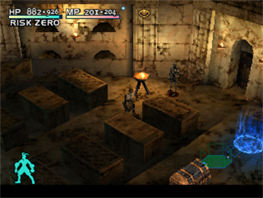
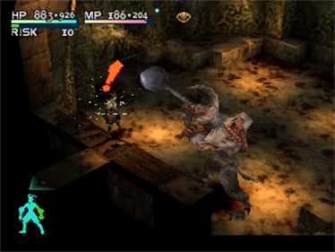
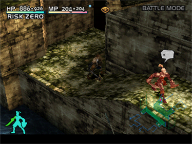
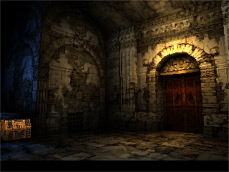
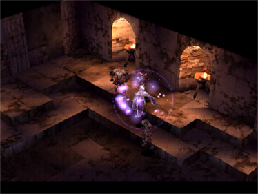

*Character Art (showing Akihiko Yoshida's art direction):*
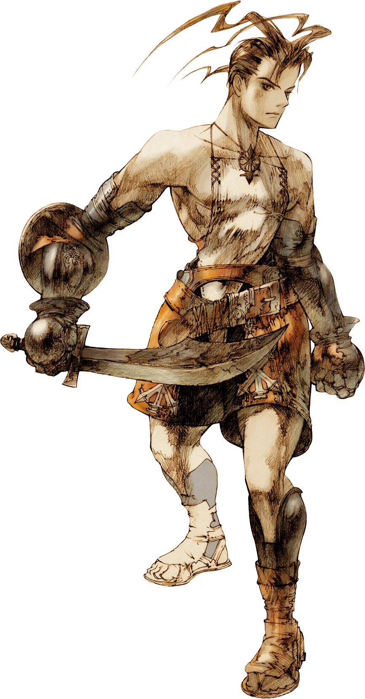
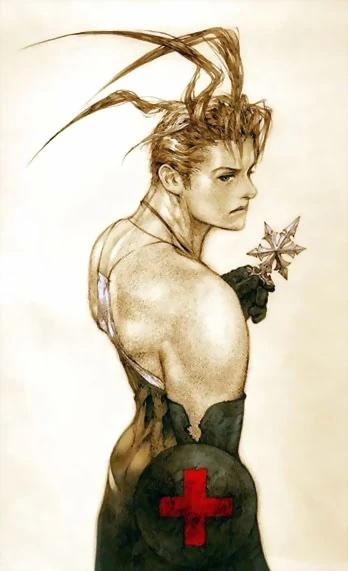
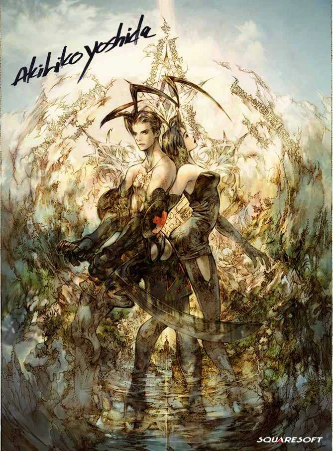

---

**Why this matters for Laney:** If we wanted a more mature, realistic look (less chibi/stylized), Aya Brea and Jill Valentine show what PSX-era realistic *female* characters looked like. The proportions are human, faces are detailed, but they still have that charming low-poly aesthetic.

---

#### Option D: DS-Era Low-Poly (Alternative platform reference)
The Nintendo DS had charming low-poly 3D with different constraints. Valid reference for a slightly different aesthetic.

**Zelda: Phantom Hourglass - Link** (DS cel-shaded low-poly)
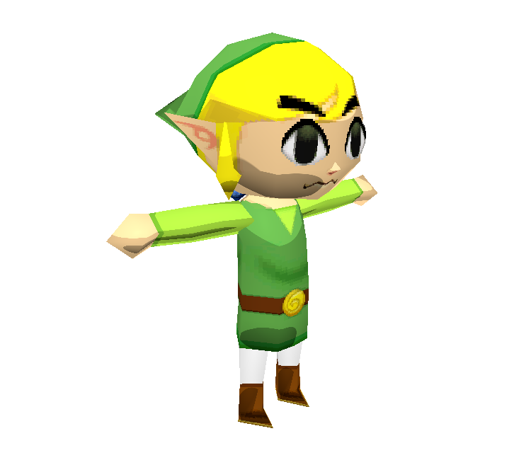

Other DS games worth checking (not downloaded):
- **Professor Layton** (3DS) - Chunky, charming character models
- **Dragon Quest IX** - Classic DQ style in low-poly
- **Animal Crossing: Wild World** - Cozy, simple character design

---

### 🏠 Environment/Background References

**Digimon World 1 - File City** (Cozy hub area, colorful PSX aesthetic)

**Legend of Mana - Home Entrance** (Painterly 2D background, warm tones)
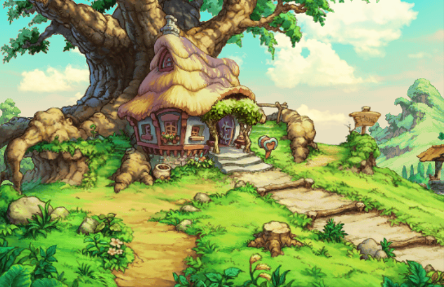

**Legend of Mana - Living Room** (Cozy interior reference)
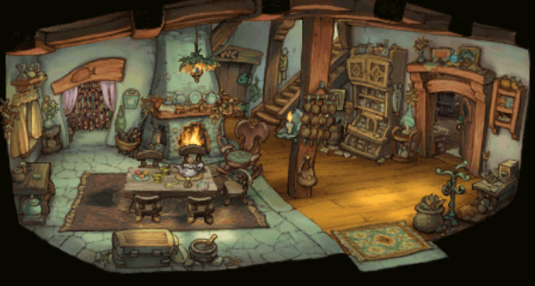

---

### 🎭 Character Art References

**Final Fantasy IX - Vivi** (Curious, bookish energy - concept art)
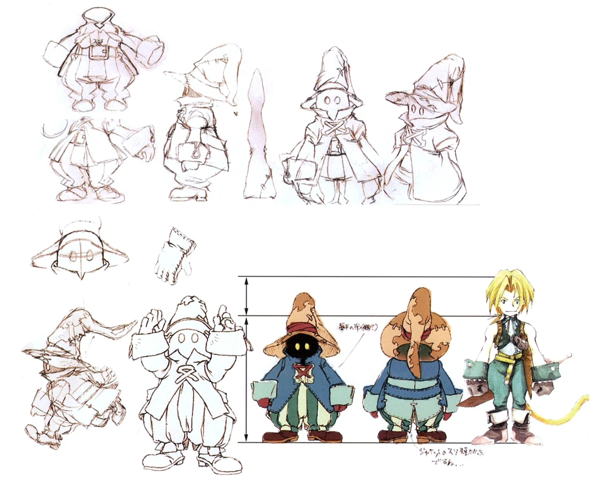

**Klonoa** (Official art showing expressive design)
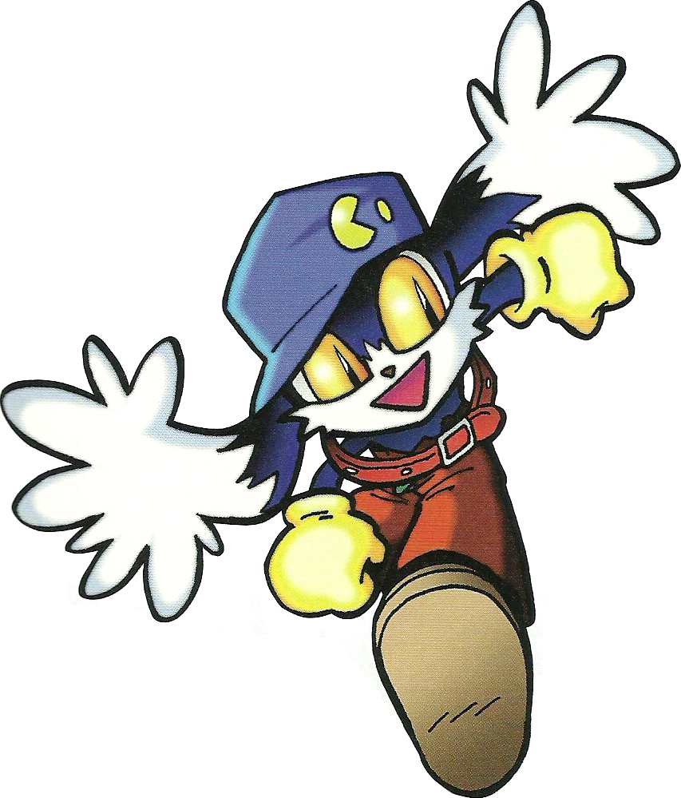

---

### Additional Resources (not downloaded)
- [MobyGames - Threads of Fate Screenshots](https://www.mobygames.com/game/playstation/threads-of-fate/screenshots)
- [Spriters Resource - Digimon World Backgrounds](https://www.spriters-resource.com/playstation/digimonworld/)
- [Wiki of Mana - Legend of Mana Backgrounds](https://wikiofmana.com/wiki/Gallery:Legend_of_Mana_(backgrounds))
- [Models Resource - Mega Man Legends](https://models.spriters-resource.com/playstation/megamanlegends/)
- [Models Resource - Vagrant Story](https://models.spriters-resource.com/playstation/vagrantstory/)
- [Models Resource - Phantom Hourglass](https://models.spriters-resource.com/ds_dsi/thelegendofzeldaphantomhourglass/)
- [Creative Uncut - Parasite Eve II Art](https://www.creativeuncut.com/art_parasite-eve-2_a.html)

---

## Character Design Notes

### Suggested Elements (artist discretion)
- **Glasses** - Librarian/researcher vibe (could be round, slightly oversized)
- **Book or Notebook** - As a prop she carries or consults
- **Warm Color Palette** - Earthy tones, maybe muted greens/browns/warm yellows
- **Approachable Silhouette** - Not intimidating, friendly proportions
- **Something Slightly Askew** - Hair slightly messy? Bookmark sticking out of pocket? Conveys she's been busy thinking

### What to Avoid
- Too polished/corporate assistant look
- Cold/sterile color palette
- Stiff, formal posture (she's relaxed, curious)
- Overly cute/anime - should feel warm but grounded

---

## Environment/Background

### Setting: Personal Library/Study

A cozy space where Laney "lives" - not a public library, more like a personal study that's grown organically.

### Key Elements
- **Bookshelves** - Full, slightly disorganized, books at angles
- **Desk/Workspace** - Papers, open books, maybe a lamp
- **Warm Lighting** - Evening/golden hour feel, lamplight
- **Lived-In Details** - Mug, bookmarks, sticky notes, maybe a plant
- **Depth Suggestion** - More books/shelves fading into background

### Mood
- Cozy, not cluttered (organized chaos)
- Inviting, makes you want to sit and read
- Warm colors: wood tones, warm yellows, soft shadows
- Late afternoon or evening lighting

---

## Animation Requirements

### What Alberto Delivers vs What Code Handles

| Alberto Delivers | Code Handles |
|------------------|--------------|
| Clean, loopable animation clips | When to play each animation |
| Smooth start/end poses for blending | Transitions between animations |
| Distinct emotional states as separate animations | Triggering animations based on AI state |
| Props in consistent positions for swapping | Interrupting/chaining animations |

---

### Required Animations

#### 1. Idle Loop (Primary)
**Deliverable:** Single loopable animation, 4-8 seconds

Suggested elements (artist discretion):
- Subtle weight shifting
- Breathing/gentle movement
- Small fidgets - not anxious, just active mind
- Maybe adjusting glasses or touching chin

**Technical:** Loop should blend seamlessly; this is the "home" state

---

#### 2. Walk Cycle
**Deliverable:** Single loopable walk cycle

- Light, curious gait
- Not marching - relaxed, wandering pace
- Clean loop for tiling

**Technical:** Code handles starting/stopping, speed variation

---

#### 3. Notebook Browsing
**Deliverable:** Single animation (loopable or one-shot, artist choice)

- Holding notebook, flipping through pages
- Looking at pages with interest

**Technical:** Code triggers this when Laney is "researching"

---

#### 4. Book Consulting
**Deliverable:** Single animation (one-shot or loopable)

- Holding open book, reading/scanning
- Engaged with the content

**Technical:** Code triggers this during "deep research" states

---

#### 5. Run Cycle
**Deliverable:** Single loopable run animation

- Faster, more energetic than walk
- Arms pumping, more bounce/urgency
- Excited body language (she found something!)

**Technical:** Code handles speed variation; slow walk is just walk cycle at reduced playback speed (no separate animation needed)

---

#### 6. Additional Animation (Artist's Choice - pick 1-2)

Suggestions (pick what feels right):

| Animation | Description | Use Case (Code) |
|-----------|-------------|-----------------|
| **Excited/Discovery** | Perks up, maybe small gesture of excitement | Triggered when Laney finds something interesting |
| **Thinking** | Hand on chin, looking up or to the side | Triggered during "processing" states |
| **Wave/Greeting** | Friendly acknowledgment | Triggered on session start or user return |
| **Reading Intently** | Very focused on book, still pose with subtle movement | Long research states |

---

### Animation Notes for Code Integration

*This section is for our reference, not animation requirements:*

**Behaviors we'll build in code by chaining these animations:**
- "Gets distracted" = Walk → sudden stop → Idle (looking at something)
- "Aha moment" = Reading → Excited/Discovery → Run (to share finding!)
- "Lost in thought" = Idle with longer duration, skip fidgets
- "ADHD wandering" = Walk (slow speed) → Stop → Look → Walk → different direction
- "Excited about discovery" = Run cycle when she found something interesting

**State machine will handle:**
- Smooth transitions between clips
- Random variation in idle (different fidgets if provided)
- Interruption priority (greeting overrides idle, etc.)
- Animation speed variation based on context

---

## Technical Notes

### Deliverables Confirmed
- Blender source files
- Exported FBX files
- Exported GLTF files
- 2D background environment

### Poly Count
Artist discretion for authentic PSX feel. Reference: PS1 characters typically 200-800 polys, but "PSX style" is more about aesthetic than strict limits.

### Texture Style
- Low resolution textures (PSX authentic)
- Vertex colors acceptable/encouraged
- No filtering (nearest neighbor) for that crisp PS1 look
- Affine texture warping optional (authentic but may be distracting)

### Integration Context
Character will be displayed in a web interface (Three.js likely) alongside the AI assistant's text responses. Animations triggered by assistant state (thinking, responding, idle, excited about a discovery).

---

## Summary

Laney should feel like a friend who happens to live in a cozy library and gets unreasonably excited about obscure knowledge. The PSX aesthetic adds warmth and nostalgia - she's not a cutting-edge AI assistant, she's a quirky librarian who genuinely loves helping you find interesting things.

The key feeling: **"Oh, you're interested in that? Let me show you something cool I found!"**

---

## Contact

For questions or clarifications:
Arthur (endarthur)

---

*Document Version: 1.0*
*Date: January 2026*
